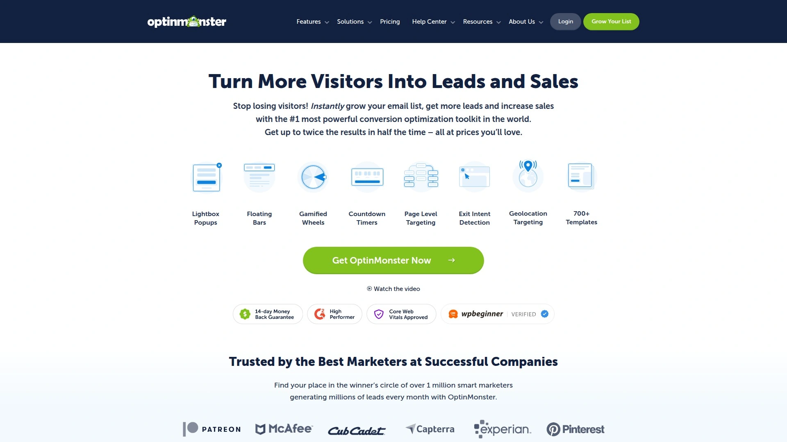
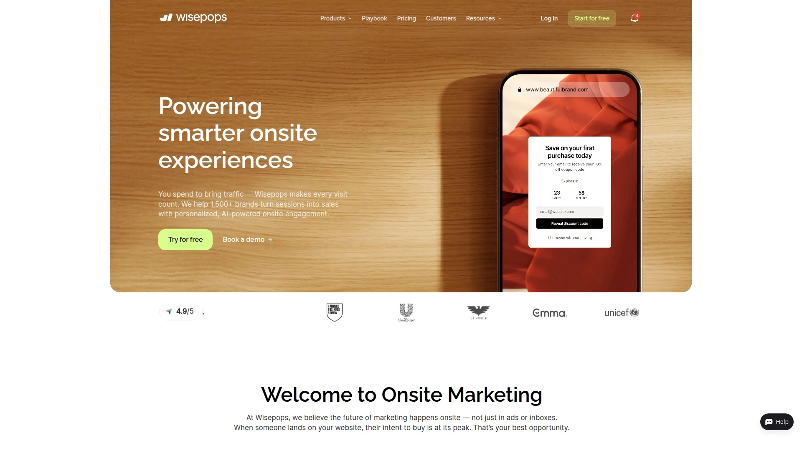
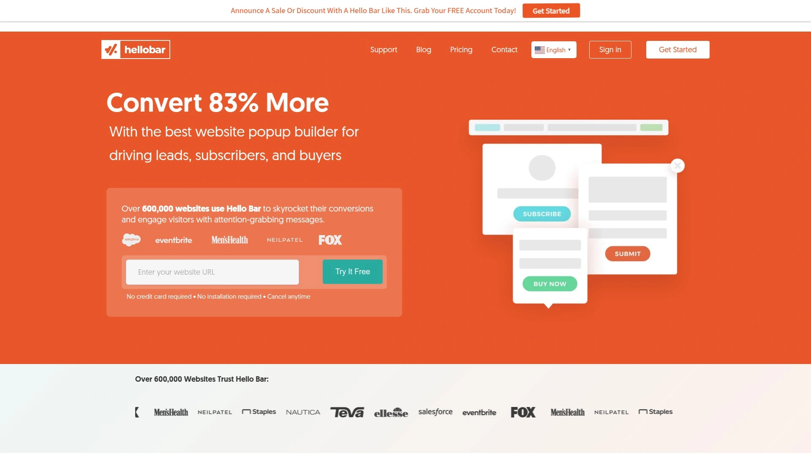
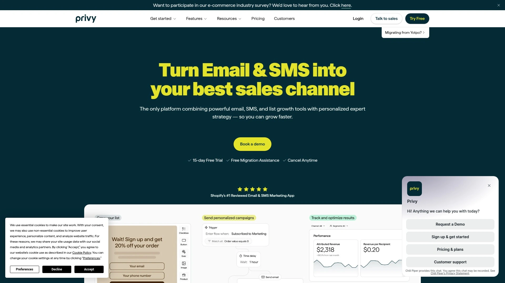
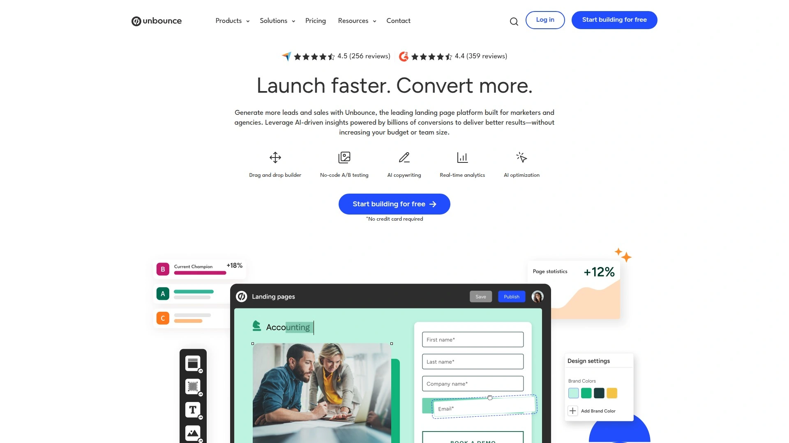
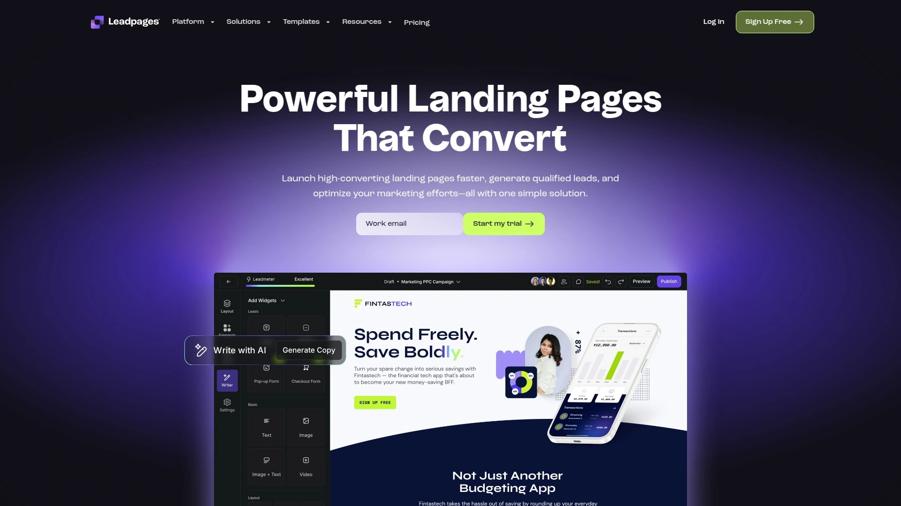
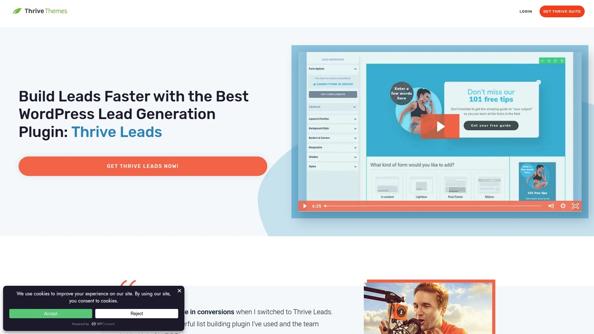
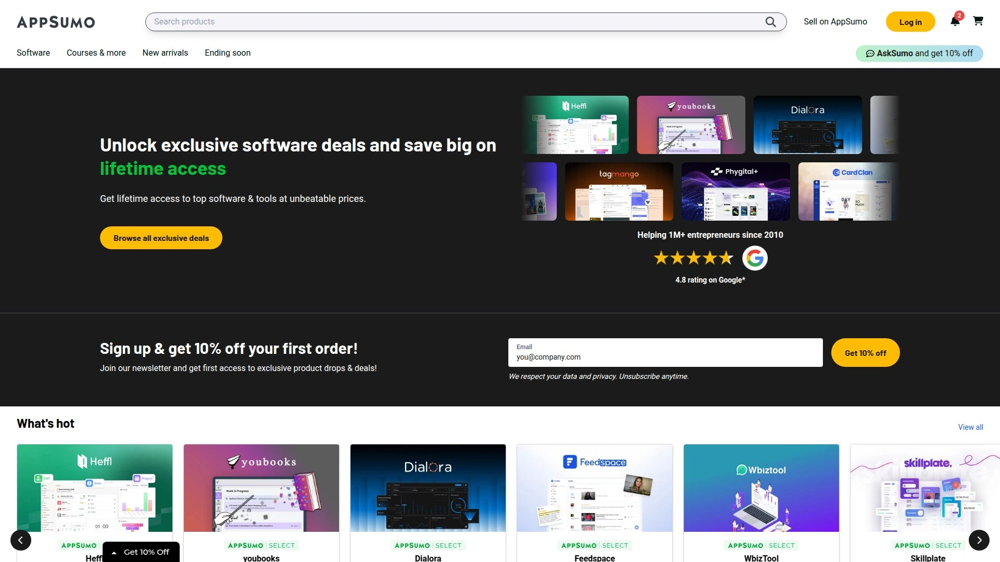
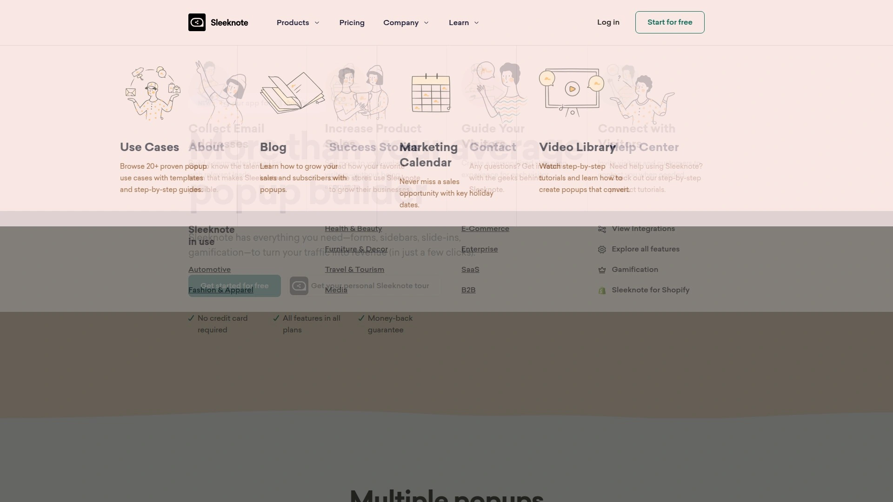
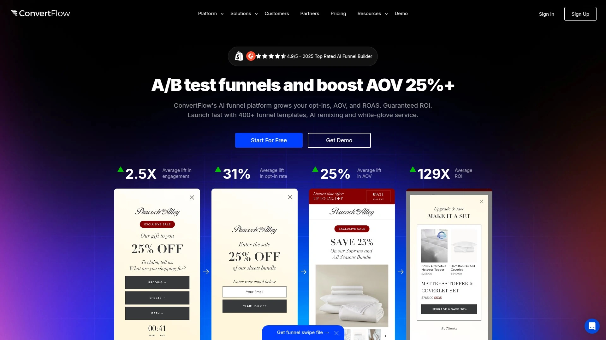

# Top 10 Best Lead Generation Software in 2025

Turning website visitors into actual leads shouldn't feel like pulling teeth. Most businesses lose over 70% of visitors who will never come back, and the average site captures fewer than 1 email for every 200 people who stop by. Lead generation software fixes that problem by showing the right message at the right moment—whether that's an exit-intent popup when someone's about to leave, a slide-in form after they've scrolled halfway down your best content, or a targeted offer based on where they came from. These tools help you grow your email list faster, reduce cart abandonment, and actually convert the traffic you're already paying for.

## **[OptinMonster](https://optinmonster.com)**

Conversion optimization toolkit trusted by over 1 million marketers to generate leads through intelligent popups, forms, and behavioral targeting.

OptinMonster operates as the most powerful lead generation platform for turning existing traffic into subscribers and customers without needing developers. The drag-and-drop builder includes over 700 pre-made templates proven to convert, covering lightbox popups, floating bars, fullscreen overlays, slide-ins, and gamified spin-to-win wheels. You're not limited to basic email capture—the platform handles countdown timers, page-level targeting, and traffic redirection for sophisticated campaigns.

**Exit Intent Technology changes everything:** The platform detects when visitors move their mouse to leave your site and triggers a targeted campaign at that exact moment. This single feature has helped businesses add 95,654 subscribers in 7 months and double subscription rates immediately without annoying users or generating complaints. Users report instant 12% lifts in driving sales when exit-intent popups are implemented correctly.

**Behavioral automation and segmentation:** OptinMonster's targeting engine shows different offers to new visitors versus returning customers, filters by geolocation, tracks scroll depth, monitors time on page, and personalizes campaigns based on traffic source. The OnSite Retargeting feature segments audiences automatically—show first-time buyers one message, VIP customers another, and cart abandoners a third. A/B testing runs directly in the platform with real-time analytics showing which variations convert best.

Works seamlessly across WordPress, Shopify, and single-page applications through simple JavaScript embedding. The WordPress plugin extends functionality with logged-in user targeting, category and tag filtering, and deep integrations with WPForms, WooCommerce, Easy Digital Downloads, and MemberPress. Shopify users get cart-specific targeting based on total value, item count, or specific products for precise upselling.

## **[Wisepops](https://wisepops.com)**

Advanced onsite marketing platform delivering popups, banners, and embedded forms with sophisticated visitor targeting and straightforward integrations.

Wisepops gives users full control over onsite campaigns through a visual builder that requires zero coding skills. The platform handles popups, top bars, embeds, and surveys with targeting based on scrolling behavior, click patterns, exit intent, time spent, and specific URL parameters. Integration with Shopify, WordPress, and custom websites happens through simple code implementation.

The tool stands out for advanced A/B testing capabilities and comprehensive analytics that show exactly which campaigns drive conversions. Users appreciate the extensive customization options that let you match brand aesthetics perfectly while maintaining fast load times. Best suited for marketers managing multiple campaign types who need granular control without technical dependencies.

## **[Hello Bar](https://www.hellobar.com)**

Trusted popup builder powering lead capture on over 600,000 websites with focus on simplicity and fast deployment.

Hello Bar specializes in converting content-rich pages into lead generation machines through native inline forms, top notification bars, and strategically placed popups. The Inline feature lets you embed lead capture units directly within blog posts and articles, turning every piece of content into a mini landing page. These native units perform better than generic popups because they feel integrated rather than intrusive.

You can place multiple inline units throughout content—different calls to action at the top versus bottom of posts. Use them to collect basic information, point visitors to related content, promote events, or announce sales directly within the pages people find most engaging. Leads captured within relevant content typically convert to customers at higher rates because they're already interested in your topic.

Pricing remains affordable compared to enterprise solutions, making it accessible for small businesses and solopreneurs. The platform handles email collection, meeting scheduling, and custom conversion goals through clear targeting options. Setup takes minutes, and the interface prioritizes speed over complexity.

## **[Privy](https://www.privy.com)**

All-in-one conversion toolkit for ecommerce businesses offering popups, email marketing, and SMS campaigns in one integrated platform.

Privy dominates Shopify stores by combining email list growth with cart abandonment recovery and automated follow-up sequences. The drag-and-drop editor makes popup creation accessible for anyone, with pre-built templates specifically designed for ecommerce goals like welcome discounts, cross-selling, and exit-intent offers. Spin-to-win gamification adds interactive elements that increase engagement and capture rates.

**Shopify-specific targeting gets granular:** Show popups on individual product or collection pages, target users based on cart total or subtotal to encourage free shipping thresholds, trigger campaigns by item count, or display upsells when specific products sit in the cart. Real-time order and browsing data let you segment high-value buyers, lapsed shoppers, and VIPs with perfectly timed campaigns.

Cart abandonment emails deploy automatically when visitors trigger exit-intent but don't convert. The platform tracks performance metrics for each campaign, letting you optimize based on actual signup and conversion data. While primarily focused on list growth, Privy includes enough popup variety to support most ecommerce marketing strategies.

## **[Unbounce](https://unbounce.com)**

Top-rated landing page builder with AI optimization, popups, and sticky bars designed for marketers who need high-converting pages fast.

Unbounce combines landing page creation with lead capture tools in one platform. The drag-and-drop builder creates personalized pages without designers or developers, using customizable templates and custom scripts for technical users who want deeper control. You get A/B testing built in, making it easy to compare headlines, layouts, and content variations.

**Smart Traffic uses AI to maximize conversions:** The algorithm analyzes visitor attributes like device type, location, and browsing behavior in real time, automatically routing each person to the landing page variant most likely to convert them. Machine learning improves performance continuously as it gathers data, delivering higher ROI without manual intervention. Small changes compound into significant results over time.

The platform includes popups and sticky bars alongside landing pages, giving you multiple conversion tools. Dynamic text replacement personalizes content automatically, while templates are specifically optimized for lead generation rather than generic web pages. Over 15,000 brands rely on Unbounce to reduce cost-per-lead and increase sales—one customer increased in-store sales by 200% while another cut lead costs by 40.7%.

## **[Leadpages](https://www.leadpages.com)**

Conversion-tested landing page platform offering drag-and-drop building, unlimited traffic, and extensive template library starting at $37 monthly.

Leadpages delivers landing pages, popups, alert bars, and lead capture forms through an intuitive builder requiring zero technical knowledge. The Standard plan at $37 monthly (billed annually) includes access to 250+ templates, unlimited traffic and leads, one custom domain, and 10,000 AI Engine credits for generating headlines and images. This makes it one of the most affordable options for small businesses and startups.

The Pro plan at $74 monthly adds A/B testing, removes transaction fees for ecommerce, provides 30,000 AI credits with writing assistance, and supports 3 custom domains. Advanced plan pricing remains custom for enterprises needing unlimited AI credits, 50 domains, multiple blogs, and dedicated success coaching. All plans include 90+ integrations with email marketing services and CRM platforms.

Best suited for digital marketers and entrepreneurs prioritizing lead generation with proven templates. The platform focuses specifically on conversion optimization rather than general web design, ensuring every element serves lead capture goals. Fourteen-day free trial lets you test functionality before committing.

## **[Thrive Leads](https://thrivethemes.com/leads/)**

WordPress-specific lead generation plugin combining every optin form type with advanced targeting, A/B testing, and conversion optimization.

Thrive Leads operates exclusively for WordPress sites, delivering lightboxes, slide-ins, two-step optins, in-content forms, and widget-area forms through one plugin. The platform emphasizes conversion optimization with features normally found in expensive agency tools. One user reported a 238% increase in conversions after switching from competing plugins.

**Hyper-targeting boosts conversions dramatically:** Show different lead magnets on specific posts, categories, or tags to match content context. Build separate lists for different audience segments, then target follow-up campaigns precisely. This relevance increases signup rates because offers align with what visitors are already reading about.

The drag-and-drop editor creates custom designs without coding, while built-in A/B testing eliminates guesswork. The plugin automatically promotes winning variations to maximize conversion rates over time. Reporting shows exactly which pages and traffic sources generate the most valuable leads, letting you double down on what works. Integrates with MailerLite, ConvertKit, and all major email platforms.

## **[Sumo](https://sumo.com)**

Feature-rich lead capture platform offering popups, scroll boxes, welcome mats, and smart bars with free plan supporting basic functionality.

Sumo provides multiple form types including traditional popups, scroll-triggered boxes, inline embeds, fullscreen welcome mats, and persistent top bars. You can create campaigns for email collection, calls to action, social sharing, or custom code implementations. The free plan includes limited features, while Plus plans starting at $29 monthly unlock exit-intent, advanced analytics, and A/B testing.

The drag-and-drop builder uses a layer system that takes initial learning but offers extensive customization once mastered. Templates range from simple to complex, all optimized for mobile devices. The platform works on any website through simple code installation.

While slightly more expensive than competitors for premium features, Sumo delivers excellent value through its combination of popup variety and social sharing tools. Best for businesses wanting comprehensive lead generation with built-in viral growth mechanisms. The tool continuously adds new features and improves existing functionality.

## **[Sleeknote](https://sleeknote.com)**

No-code popup builder focused on personalized forms, quizzes, and gamification for growing email lists and engaging shoppers.

Sleeknote targets marketers who want to turn website traffic into email subscribers and customers through behavioral personalization. The platform includes drag-and-drop design with full branding control, spin-to-win wheels, scratch cards, multistep quizzes, and surveys that collect zero-party data directly from visitors. Countdown timers, hello bars, exit-intent triggers, and upsell popups drive revenue while maintaining user experience.

**Shopify-specific targeting leverages real-time data:** Create campaigns based on cart value, products added, browsing history, or customer segments. Personalized popups perform better because they respond to actual visitor behavior rather than showing generic messages to everyone. The platform integrates seamlessly with Klaviyo, Mailchimp, HubSpot, and Google Analytics.

Implementation requires only a tracking code added once to your website backend or through Google Tag Manager. Run popups across multiple domains from one account by adding the code and specifying domain names when building campaigns. Advanced targeting options let you show different messages to different audiences based on dozens of criteria.

## **[ConvertFlow](https://www.convertflow.com)**

All-in-one funnel builder merging calls-to-action, quizzes, forms, and landing pages into unified conversion campaigns.

ConvertFlow operates as a comprehensive funnel platform rather than just a popup tool. The system lets you build complete conversion paths that guide visitors from awareness through lead capture to sales. Merge CTAs, surveys, quizzes, and landing pages into single campaigns that adapt based on user responses.

Particularly effective for marketers running sophisticated segmentation strategies where different audiences need different conversion paths. The platform handles personalization at scale, showing tailored content based on traffic source, behavior, and previous interactions. This complexity makes it more powerful than basic popup tools but requires more setup time.

Integrates deeply with email platforms and CRMs to maintain data consistency across your marketing stack. Best suited for businesses with mature marketing operations that need granular control over the entire lead generation funnel rather than simple email capture forms.

---

## Common Questions

**What's the difference between popup software and landing page builders for lead generation?**

Popup software captures leads directly on your existing website by displaying targeted forms, bars, or overlays without sending visitors elsewhere. Landing page builders create standalone pages specifically for conversion campaigns. OptinMonster excels at onsite capture with behavioral targeting, while Unbounce and Leadpages focus on dedicated landing pages. Many businesses use both—popups for visitors already browsing content, landing pages for paid ads and email campaigns.

**Do popup tools slow down website loading times?**

Quality popup platforms like OptinMonster load asynchronously and non-blocking, meaning they don't delay your page content from appearing. The embed code loads separately from your main site, ensuring visitors see your content immediately while the popup system initializes in the background. Poorly coded popup solutions can impact speed, which is why choosing established platforms matters for both conversions and SEO.

**How much should small businesses budget for lead generation software?**

Entry-level options range from free plans with limited features to $37-49 monthly for basic paid plans. OptinMonster, Hello Bar, and Privy offer accessible pricing for small businesses, while Leadpages starts at $37 monthly. Mid-tier plans with advanced targeting and A/B testing typically cost $74-99 monthly. WordPress-only solutions like Thrive Leads charge one-time fees around $99-299 rather than recurring subscriptions. Budget based on traffic volume and feature needs.

***

## Turn Your Traffic Into Revenue

Getting more visitors doesn't matter if they leave without taking action. The right lead generation software captures intent before people disappear, turning anonymous browsers into identified leads you can market to repeatedly. [OptinMonster](https://optinmonster.com) dominates this space for businesses serious about conversion optimization because its behavioral targeting shows contextually relevant offers at precisely the right moment—exit-intent when leaving, geolocation-based promotions for local visitors, and OnSite Retargeting that treats new visitors differently than returning customers, all without requiring developer help.
